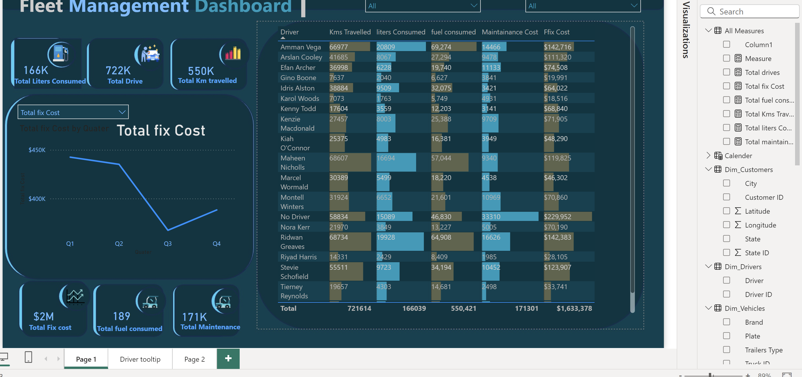
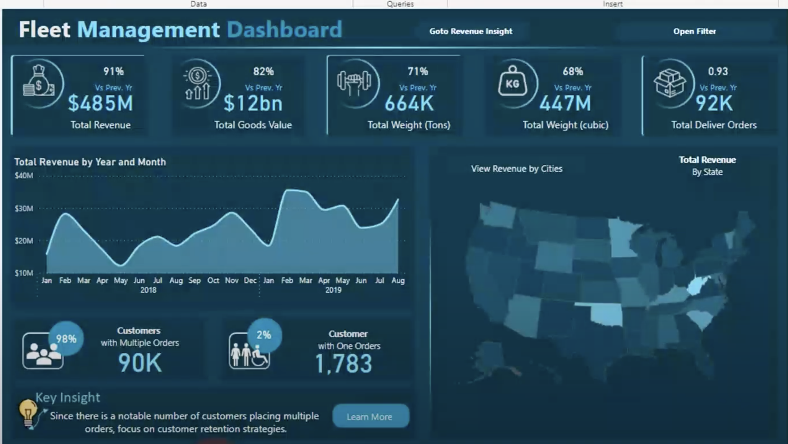

# Fleet Management Dashboard

## 🚚 Overview
This repository contains an interactive Power BI dashboard for managing and analyzing fleet operations. The dashboard provides comprehensive insights into fleet performance metrics, costs, revenue, and maintenance activities, enabling data-driven decision-making to improve efficiency and profitability.

---

## 📊 Features

### **Dashboard 1: Operational Insights**
1. **KPIs Overview**
   - **166K** liters of fuel consumed.
   - **722K** total drives completed.
   - **550K** kilometers traveled.
   - **$2M** total fixed costs.
   - **171K** total maintenance costs.

2. **Total Fix Costs by Quarter**
   - Tracks total fixed costs across all quarters.
   - Identifies trends in cost reduction and spikes.

3. **Driver-Specific Analysis**
   - Breakdown of:
     - Kilometers traveled.
     - Liters consumed.
     - Fuel and maintenance costs.
   - Driver-specific fixed costs for detailed performance tracking.

---

### **Dashboard 2: Revenue and Customer Insights**
1. **Revenue Metrics**
   - **$485M** total revenue (91% of the previous year).
   - **$12bn** total goods value transported.
   - **664K tons** and **447M cubic meters** of goods moved.

2. **Revenue Trends**
   - Yearly and monthly revenue trends plotted to identify seasonal highs and lows.

3. **Geographical Insights**
   - Interactive map showing revenue distribution by state and city.

4. **Customer Insights**
   - **90K** customers with multiple orders (98% of total).
   - Focus on retaining **repeat customers** while addressing **1,783 single-order customers**.

---

### **Key Insights and Recommendations**
#### Insights:
1. Significant cost reduction observed in Q3 for fixed costs.
2. Repeat customers contribute significantly to revenue, highlighting opportunities for retention strategies.
3. Mondays and specific drivers show higher operational costs, warranting closer monitoring.

#### Recommendations:
1. **Customer Retention Strategies**:
   - Implement loyalty programs and targeted promotions for repeat customers.
   - Engage single-order customers to convert them into loyal clients.

2. **Cost Management**:
   - Optimize maintenance schedules to minimize downtime.
   - Review high-cost drivers' performance to identify inefficiencies.

3. **Revenue Growth**:
   - Focus on high-revenue states and cities for expanding services.
   - Upsell additional services to repeat customers.

4. **Sustainability Initiatives**:
   - Monitor fuel consumption to improve eco-efficiency.
   - Explore alternative energy options for fleet vehicles.
   - # Driver Tooltip in Power BI Dashboard

## Overview
- **Purpose**: To provide a concise summary of key driver performance metrics at a glance.
- **Tool**: Created using **Power BI's Tooltip Feature** to enhance the interactivity of the dashboard.

## Features
1. **Key Metrics Displayed**:
   - **Total Drive**: The total distance driven by the driver.
   - **Average Fuel Efficiency**: Efficiency in terms of fuel usage per kilometer.
   - **Total Fuel Consumed per km**: Fuel consumption for each kilometer traveled.
   - **Total Fuel Cost per km**: Cost incurred for fuel per kilometer.
   - **Average Driver Speed**: Average speed of the driver during the trip.

2. **Design Highlights**:
   - Clean and minimalistic design with a focus on readability.
   - Utilized color contrasts to improve visualization clarity.

3. **Dynamic Data Integration**:
   - Tooltip dynamically adjusts based on driver-specific data selected in the dashboard.
   - Ensures real-time updates with filters applied.

## Benefits
- Enhances the user's ability to evaluate driver performance quickly.
- Reduces the need to navigate multiple pages for detailed information.
- Supports decision-making by providing actionable insights in a compact format.

## Technologies Used
- **Power BI**: For data modeling and visualization.
- **Data Sources**: Integrated metrics from tables such as `Dim_Drivers`, `Factable_Freight`, and others.

---

## 🛠️ How to Use
1. **Interact with the Dashboard**:  
   Open the Power BI file to explore operational and revenue data.

2. **Filter Data**:  
   Use built-in filters to analyze metrics by driver, state, customer segment, and more.

3. **Generate Insights**:  
   Leverage the visualizations and insights to optimize fleet management strategies.

---

## 📈 Visualizations
- **KPIs Tiles**: Display high-level metrics such as revenue, costs, and operational performance.
- **Line Charts**: Track trends in revenue and costs over time.
- **Bar Charts**: Compare driver performance and operational metrics.
- **Maps**: Visualize revenue distribution geographically.
- **Tables**: Provide detailed breakdowns of driver-specific metrics.

---

## 🔑 Key Insights to Improve Customer Retention
1. **Customer Retention Strategies**:  
   Focus on repeat customers by implementing personalized communication and loyalty programs.

2. **Upselling Opportunities**:  
   Identify patterns in repeat customers to recommend relevant services and products.

3. **Engagement Campaigns**:  
   Use newsletters and email campaigns to keep customers informed about new services and promotions.

4. **Feedback and Reviews**:  
   Encourage customers to provide feedback to improve service quality and attract new business.

5. **Targeted Marketing**:  
   Segment customers based on behavior and tailor campaigns to drive repeat business.

---

## 📝 License
This project is licensed under the **MIT License**. See the [LICENSE](LICENSE) file for more details.

---

## ✨ Dashboard Previews
### Operational Dashboard

### Revenue Insights Dashboard

---

Feel free to contribute or provide feedback to improve the dashboard and insights! 🚀
